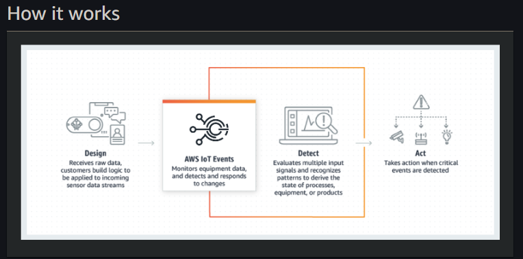

## IoT Events

Fuente Diversas | Modelado visual 
------------ | -------------
acepta entradas de muchas fuentes de datos de telemetría de IoT, incluidos dispositivos de sensores, aplicaciones de administración y otros servicios de AWS IoT.|  Con el lienzo activo, AWS IoT Events permite un modelado visual sencillo de los estados de un dispositivo o proceso y las transiciones entre ellos.

Monitorear a escala |Tomar accion 
------------ | -------------
Además de mantener registros de actividad, controle el estado actual y las estadísticas recientes de dispositivos y procesos en tiempo real. | Activar acciones en Amazon SNS o AWS IoT Core. También active las funciones de AWS Lambda, lo que permite tomar acciones empleando una gama aún más amplia de otros servicios.

#By:
#Lara
#Osorio
#Ramos
