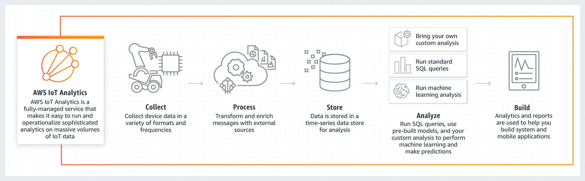

# AWS IoT Analytics
 
AWS IoT Analytics es un servicio completamente administrado que facilita la ejecución e instrumentación de análisis sofisticados de enormes volúmenes de datos de IoT, sin tener que preocuparse por todo el costo y la complejidad normalmente obligatorios en la creación de una plataforma de análisis de IoT. Es la manera más sencilla de ejecutar análisis de datos de IoT y obtener información con la que tomar decisiones mejores y más precisas para aplicaciones de IoT y casos de uso de aprendizaje automático.
 
Los datos de IoT están muy desorganizados, lo cual dificulta el análisis con herramientas tradicionales de análisis e inteligencia empresarial diseñadas para procesar datos estructurados. Los datos de IoT suelen proceder de dispositivos que graban procesos con ruido (tales como temperatura, movimiento o sonido). Por ello, los datos de estos dispositivos pueden tener con frecuencia discontinuidades notables, mensajes dañados y lecturas falsas que se deben limpiar antes de poder llevar a cabo un análisis. Además, los datos de IoT suelen ser significativos solo en el contexto de entradas de datos adicionales de terceros. Por ejemplo, para ayudar a que los agricultores determinen cuándo tienen que regar sus cultivos, los sistemas de riego de viñedos suelen enriquecer los datos del sensor de humedad con datos sobre precipitaciones del viñedo, permitiendo un uso más eficiente del agua al tiempo que se maximiza el rendimiento de la cosecha.

AWS IoT Analytics automatiza cada uno de los difíciles pasos obligatorios para analizar los datos de los dispositivos IoT. AWS IoT Analytics filtra, transforma y enriquece datos de IoT antes de almacenarlos en un almacén de datos de series temporales para su análisis. Puede configurar el servicio para recopilar solo los datos que necesita de sus dispositivos, aplicar transformaciones matemáticas a los datos para procesarlos, y enriquecerlos con metadatos específicos del dispositivo, como el tipo de dispositivo y la ubicación, antes de almacenar los datos procesados. A continuación, puede analizar los datos mediante la ejecución de consultas ad hoc o programadas con el motor de consultas SQL integrado o llevar a cabo análisis más complejos e inferencias de aprendizaje automático. AWS IoT Analytics facilita comenzar a trabajar con el aprendizaje automático incluyendo modelos prediseñados para casos de uso de IoT comunes.

También puede utilizar su propio análisis personalizado, embalado en un contenedor, para ejecutarlo en AWS IoT Analytics. AWS IoT Analytics automatiza la ejecución de sus análisis personalizados creados en Jupyter Notebook o sus propias herramientas (como, por ejemplo, Matlab, Octave, etc.) que se deben ejecutar en su propio programa.

AWS IoT Analytics es un servicio completamente administrado que instrumentaliza los análisis y se amplía automáticamente para soportar petabytes de datos de IoT. Con AWS IoT Analytics, puede analizar datos de millones de dispositivos y crear aplicaciones de IoT rápidas y con capacidad de respuesta sin administrar el hardware ni la infraestructura.

## Beneficios de AWS IoT Analytics

#### Instrumentalización de los flujos de trabajo analíticos

Usted proporciona el análisis, AWS IoT Analytics automatiza la ejecución del análisis cuándo y dónde lo necesite. AWS IoT Analytics importará los contenedores de código escrito personalizados, herramientas externas integradas como Matlab, Octave, etc. y las ejecuta en su programa para generar información operativa, permitiéndole que disponga de más tiempo para centrarse en lo que mejor sabe hacer.

#### Ejecución fácil de consultas de datos de IoT

Con AWS IoT Analytics, puede ejecutar sencillas consultas ad hoc con el motor de consultas SQL integrado. Utilizando consultas SQL estándar para extraer datos desde el almacén de datos, puede calcular la distancia promedio recorrida por una flota de vehículos o el número de puertas bloqueadas en un edificio inteligente, por ejemplo. Además, AWS IoT Analytics proporciona una serie de ventanas de tiempo continuas no solapadas para realizar análisis sobre datos nuevos incrementales. Puede mejorar la eficiencia del análisis y reducir costos explorando solo los datos que necesite.

#### Almacenamiento de datos optimizado para IoT

AWS IoT Analytics almacena los datos procesados del dispositivo en un almacén de datos de serie temporal optimizado para brindar tiempos de respuesta rápidos en consultas de IoT. Los datos sin procesar también se almacenan automáticamente para su procesamiento posterior o para volver a procesarlos en otro caso de uso.

#### Preparación de los datos de IoT para su análisis

AWS IoT Analytics incorpora técnicas de preparación de datos que facilitan la preparación y el procesamiento de los datos para su análisis. AWS IoT Analytics también soporta análisis de serie temporal para que pueda analizar el desempeño de los dispositivos a lo largo del tiempo y saber cómo y dónde se utilizan, monitorear de forma continua los datos de los dispositivos para anticipar problemas de mantenimiento y monitorizar sensores para anticipar condiciones medioambientales y reaccionar en consecuencia. AWS IoT Analytics está integrado con AWS IoT Core, para adquirir de forma sencilla los datos directamente de los dispositivo conectados. Depura lecturas falsas, rellena lagunas de los datos y realiza transformaciones matemáticas de los datos de los mensajes. Conforme se adquieren los datos, AWS IoT Analytics puede procesarlos utilizando instrucciones condicionales, filtrar datos para recopilar solo los datos que se desean analizar y enriquecerlos con información del registro de AWS IoT. Asimismo, puede utilizar funciones de AWS Lambda para enriquecer los datos de sus dispositivos desde fuentes externas como Weather Service, HERE Maps, Salesforce o Amazon DynamoDB.

#### Herramientas de aprendizaje automático

AWS IoT Analytics facilita la aplicación del aprendizaje automático a los datos de IoT con blocs de notas de Jupyter alojados. Puede conectar directamente los datos de IoT al bloc de notas y crear, entrenar y ejecutar modelos desde la consola de AWS IoT Analytics sin necesidad de administrar la infraestructura subyacente. Con AWS IoT Analytics, puede aplicar algoritmos de aprendizaje automático a los datos de sus dispositivos para generar la puntuación del estado de cada dispositivo de la flota. Por ejemplo, un fabricante de automóviles puede detectar cuáles de sus clientes tienen las pastillas de freno gastadas y avisarlos para que soliciten el mantenimiento de sus vehículos. Con solo hacer clic en un botón, también puede empaquetar su código de Jupyter Notebook en una imagen de contenedor ejecutable y ejecutar dicho contenedor en AWS IoT Analytics según sea necesario.

#### Escalado automático con tarifas de pago por uso
AWS IoT Analytics es un servicio completamente administrado de pago por uso que se amplía automáticamente para soportar petabytes de datos de IoT. Con IoT Analytics, puede analizar toda la flota de dispositivos conectados sin administrar el hardware ni la infraestructura. A medida que cambian sus necesidades, la potencia de computo y el almacén de datos se amplían o reducen automáticamente para que siempre disponga de la capacidad adecuada para sus aplicaciones de IoT y únicamente pague por los recursos que utilice.

## Casos de uso

#### Agricultura inteligente
AWS IoT Analytics puede enriquecer de forma automática los datos de IoT de los dispositivos con metadatos contextuales gracias al registro de AWS IoT y otras fuentes de datos públicas, de modo que puede realizar análisis que se factorizan por tiempo, ubicación, temperatura, altitud y otras condiciones medioambientales. Con este análisis, puede escribir modelos que suministran acciones recomendadas que los dispositivos pueden efectuar sobre el terreno. Por ejemplo, los operadores de maquinaria agrícola conectada pueden utilizar AWS IoT Analytics para enriquecer los datos del sensor de humedad con las precipitaciones previstas para optimizar la eficiencia del agua de sus equipos de riego automático.

#### Mantenimiento predictivo
AWS IoT Analytics proporciona plantillas predefinidas para ayudarle a crear modelos sólidos de mantenimiento predictivo y aplicarlos a la flota. Por ejemplo, podría utilizar AWS IoT Analytics para predecir mejor cuándo se producirán averías en los sistemas de calefacción y ventilación de vehículos de carga conectados y servicios para redirigir para evitar daños en la carga.

#### Reposición proactiva de suministros
AWS IoT Analytics le permite crear aplicaciones de IoT que pueden monitorizar inventarios en tiempo real. Por ejemplo, una compañía de alimentos y bebidas puede utilizar AWS IoT Analytics para analizar los datos de sus máquinas expendedoras de comida y realizar los pedidos de productos de forma proactiva para la máquina y artículo correctos en el momento en que empiecen a escasear los productos.

#### Valoración de la eficiencia del proceso
Con AWS IoT Analytics, las compañías pueden crear aplicaciones que monitoricen de manera constante la eficiencia de los distintos procesos y tomar medidas para mejorarlos. Por ejemplo, una empresa minera puede mejorar la eficiencia de sus camiones de mineral maximizando la carga en cada viaje. Con AWS IoT Analytics, la empresa puede identificar la carga más eficiente para una ubicación o camión a lo largo del tiempo y, a continuación, comparar las diferencias respecto a la carga objetivo en tiempo real y planificar mejor las directrices de carga para mejorar la eficiencia.

## Funcionamiento

#### Jonathan Gonzalez Rosales, Marco Antonio Rodriguez Medrano, Daniel Alejandro Villanueva Mercado.
